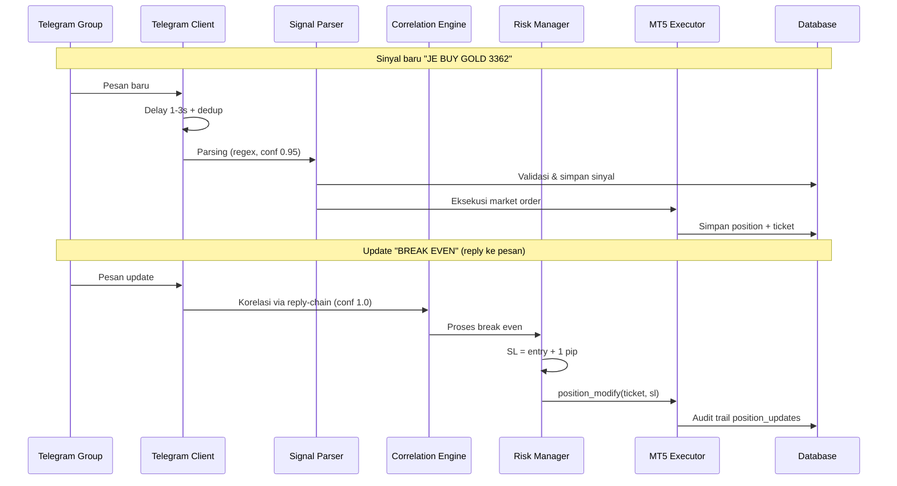

# Workflow Telegram Signal EA (telegram-signal-mt5)

Dokumen ini merangkum alur kerja sistem Telegram Signal EA berdasarkan kode sumber dan dokumentasi arsitektur dalam project ini.

## 1. Ringkasan Sistem

Sistem adalah aplikasi monolitik modular berbasis **event-driven async pipeline** (Python asyncio):

```
Telegram Group → Telegram Client → Signal Parser (Regex → LLM) → Validator → MT5 Executor → Position Tracker
                                                    ↘ Correlation Engine → Risk Manager → MT5 Executor
```

Urutan komponen utama berdasarkan `src/`:

| Layer | Modul | Tanggung jawab |
|-------|-------|----------------|
| Ingestion | `telegram_client/` | Pantau grup Telegram via Telethon (user session) |
| Buffer | `queue_manager/` | Antrian pesan (raw → parsed → validated) |
| Processing | `signal_parser/` | Parse sinyal: regex cepat + fallback LLM |
| Context | `correlation_engine/` | Korelasi pesan update ke posisi |
| Execution | `mt5_executor/` | Eksekusi order & modifikasi SL/TP/close |
| Risk | `risk_manager/` | Break-even, close, modify, konteks update |
| Persistence | `database/` | SQLite via SQLAlchemy (repository pattern) |
| Monitoring | `monitoring/` | Health check, metrics, dashboard, alerting |

---

## 2. Siklus Hidup Aplikasi

### 2.1 Startup (`main.py` → `ApplicationManager.startup()`)
1. Setup logging (`config/logging_config.py`).
2. Register signal handler SIGTERM/SIGINT untuk graceful shutdown.
3. Inisialisasi monitoring dulu: `HealthMonitor`, `MetricsCollector`, `ConsoleDashboard`.
4. Start dashboard sebagai background task.
   > Catatan: TODO — inisialisasi config, database, Telegram client, pipeline, dan MT5 belum terpasang di `startup()`.

### 2.2 Run Loop
- `ApplicationManager.run()` menunggu event shutdown (`asyncio.Event`).

### 2.3 Graceful Shutdown (SIGTERM/SIGINT)
1. Simpan state aplikasi ke `data/state/` (queue state, metrics summary, health status).
2. Stop monitoring components (dashboard, health monitor).
3. TODO: stop pipeline, tutup koneksi MT5/Telegram/database.
4. Cancel semua background task dengan timeout 30 detik.
5. Flush & close semua log handler.

### 2.4 CLI (`cli.py`)
| Perintah | Aksi |
|----------|------|
| `python cli.py start` | Jalankan `python main.py &`, tulis PID ke `data/signal_ea.pid` |
| `python cli.py stop` | Kirim SIGTERM, tunggu hingga 10 detik, force SIGKILL bila perlu |
| `python cli.py status` | Cek apakah proses berjalan |

---

## 3. Alur Pemrosesan Sinyal Utama

```
Telegram Group → MessageHandler → Signal Parser → Validator → MT5 Executor → Database
                  (ingest)      (regex/LLM)     (dedupe)    (order)      (persist)
```

### 3.1 Ingestion Pesan — `telegram_client/message_handler.py`
1. Terima event `NewMessage` dari grup terpantau.
2. Hanya proses pesan teks (abaikan media/stiker).
3. Ekstrak metadata: `telegram_message_id`, `telegram_chat_id`, sender (dihash `user_<id>`), timestamp, `raw_text`, `reply_to_message_id`, `chat_title`, `is_forwarded`.
4. **Deduplikasi**: kunci `chat_id_message_id`, history dibatasi 1000 (trim ke 500 terakhir).
5. Log untuk monitoring (preview 100 karakter, sanitasi) lalu panggil callback ke pipeline.

### 3.2 Parsing Sinyal — `signal_parser/`

**Langkah 1 — Regex cepat** (`regex_parser.py`, confidence 0.95):
1. Normalisasi teks (strip + uppercase).
2. Coba `main_patterns` (kombinasi paling spesifik), lalu pola terkait GOLD & aksi.
3. Jika gagal, coba component parsing (aksi → instrumen → harga).
4. Normalisasi simbol: `OR→GOLD`, `XAU/USD/XAU→XAUUSD`.
5. Validasi internal: harga GOLD 3000–4000, logika SL untuk BUY (SL < entry) dan SELL (SL > entry), jarak SL/TP.

**Langkah 2 — Fallback LLM** (`llm_parser.py`, confidence 0.80):
1. Cek cache (`llm_cache`, input-hash, expiry 24 jam).
2. `llm_rate_limiter.acquire()` untuk RPM limit.
3. Request ke gpt-5-mini dengan prompt `config/prompts/signal_parser.txt`, format JSON.
4. Jaga-jaga dengan `circuit_breaker` (threshold 5, recovery 60s).
5. Simpan hasil sukses (confidence ≥ 0.5) ke cache.

### 3.3 Validasi — deduplikasi & sanity check
1. Cek duplikat (hash + time window).
2. Validasi rentang harga.
3. Query sinyal terbaru sebagai konteks.

### 3.4 Status Sinyal (`SignalStatus`)
`PENDING → VALIDATED → EXECUTED | REJECTED` (juga `EXPIRED`).
- Valid & unik → eksekusi.
- Invalid/duplikat → `REJECTED` dengan alasan.

### 3.5 Eksekusi MT5 — `mt5_executor/`
1. Koneksi via `MT5ConnectionManager` (`connection.py`).
2. `market_order_send` → dapat ticket.
3. Simpan position dengan ticket, link ke `signal_id`.
4. Semua operasi dilindungi `circuit_breaker` + `retry_on_failure` (3x, backoff 2x).

---

## 4. Alur Update Kontekstual (Break Even / Close / Modify)

Pesan update dari grup dieksekusi berdasarkan hasil klasifikasi & korelasi:

```
Pesan Update → Deteksi Aksi (BE/CLOSE/MODIFY) → Korelasi ke Posisi
                    ↘ ambigu → LLM Context Analysis (gpt-5-mini) → ContextProcessor
```

### 4.1 Korelasi Pesan → Posisi — `correlation_engine/correlator.py`
1. **Reply-chain (priority tinggi)**: `reply_tracer.trace_reply_chain()` ke root message → cari posisi via `find_by_message_id` → confidence 1.0.
2. **Fallback time-based** (`time_matcher.py`): jendela 5 menit, skor kedekatan waktu + kemiripan teks, ambil kandidat terbaik dengan threshold **confidence ≥ 0.75**.
3. Simpan relasi di `message_correlations` (parent ↔ child, type REPLY/FOLLOWUP).

### 4.2 Break Even — `risk_manager/break_even.py`
1. `detect_break_even_signal()`: pola FR/EN (`BREAK EVEN`, `BE`, `SÉCURISER`, `ENTRY+1`, dll).
2. Korelasi ke posisi.
3. Threshold korelasi 0.75.
4. **Idempotensi**: tolak jika update BREAK_EVEN sukses sudah ada untuk posisi.
5. Hitung SL baru = **entry + 1 pip** (`add_pips_to_price`, normalize `GOLD`).
6. Catat audit trail `position_updates` (UpdateType.BREAK_EVEN).

### 4.3 Close — `risk_manager/close_processor.py`
Deteksi pola FR/EN, prioritas:
1. **CLOSE_ALL** (confidence 0.95) — filter simbol opsional; close konkuren via `asyncio.gather`, sukses jika ≥ 80% tertutup.
2. **PARTIAL_CLOSE** (0.9) — % numerik (`close 50%`) atau teks (`moitié/half` = 0.5).
3. **FULL_CLOSE** (0.8) — `close`, `fermez`, `tp hit`, `exit`.
Eksekusi via `position_manager.close_position_full/partial` → update DB + audit `record_close_attempt`.

### 4.4 LLM Context Analysis untuk Pesan Ambigu — `signal_parser/context_analyzer.py`
1. Tidak cocok pola langsung → kirim ke gpt-5-mini dengan konteks: pesan saat ini, pesan parent, daftar posisi terbuka (maks 10).
2. Output JSON: `{action: breakeven|close|modify|unknown, target_position, parameters, confidence, reasoning}`.
3. Validasi action + confidence 0.0–1.0.

### 4.5 Context Processor — `risk_manager/context_processor.py`
- **Confidence ≥ 0.75** → eksekusi otomatis, routing ke processor sesuai aksi (break_even / close / modify).
- **Confidence < 0.75** → `QUEUED_FOR_REVIEW` (log warning, audit trail, menunggu manual review).
- Semua hasil lengkap dengan audit trail (`LLM_ANALYSIS`).

---

## 5. Sinkronisasi Posisi (Position Monitor)

Setiap **5 detik**:
1. `positions_get()` — ambil posisi saat ini dari MT5.
2. Ambil posisi terpantau dari database.
3. Bandingkan → deteksi diskrepansi:

| Diskrepansi | Aksi |
|-------------|------|
| Posisi ditutup manual | Update status → `CLOSED`, catat harga & waktu tutup |
| Posisi baru tak terpantau | Alert + buat record posisi |
| SL/TP diubah eksternal | Update DB + buat `position_update` audit |

Status posisi: `OPEN → CLOSED` (juga `CANCELLED`, `EXPIRED`).

---

## 6. Persistence & Data Model (`src/database/models.py`)

| Tabel | Deskripsi | Kolom kunci |
|-------|-----------|-------------|
| `signals` | Sinyal terparse | `telegram_message_id` (unik), `parsed_action`, `symbol`, `entry_price`, `status` |
| `positions` | Posisi MT5 | `mt5_ticket` (unik), `volume`, `current_sl/tp`, `profit`, `status` |
| `position_updates` | Audit trail modifikasi | `update_type`, `old_value/new_value`, `success` |
| `message_correlations` | Relasi parent-child pesan | `parent_message_id`, `child_message_id`, `correlation_type` |
| `llm_cache` | Cache respons LLM | `input_hash`, `prompt_type`, `expires_at` |
| `health_metrics` | Data monitoring | `component`, `metric_name`, `status` |

Migrations via `scripts/migrate_database.py` / Alembic (`src/database/migrations/`).

---

## 7. Pengamanan & Ketahanan

| Mekanisme | Penerapan |
|-----------|-----------|
| Rate limit Telegram | Delay 1–3 detik antar pesan (`TELEGRAM_RATE_LIMIT_DELAY`, default 2.0s) |
| Rate limit LLM | `llm_rate_limiter` RPM (default 60) + exponential backoff saat gagal |
| Circuit breaker | OpenAI API & MT5 ops (threshold gagal, recovery timeout) |
| Retry & rollback | `retry_on_failure` (3x, delay 1s, backoff 2x); `rollback_modification` untuk SL/TP |
| Idempotensi | Cek ulang BE, dedup pesan, unique constraints DB |
| Privacy | Sender di-hash, log konten disanitasi/di-hash |
| Audit trail | Semua modifikasi posisi dicatat di `position_updates` |

---

## 8. Monitoring & Logging

- **Health check** tiap 60 detik (Telegram, MT5, komponen lain) → status `HEALTHY/WARNING/CRITICAL`.
- **Metrics**: `MetricsCollector` (history 60 menit), export berkala.
- **Console dashboard**: refresh tiap 2 detik (`rich`).
- **Log files** (rotating):
  - `logs/app.log` (10 MB) — aplikasi
  - `logs/error.log` (5 MB) — error
  - `logs/trades.log` (20 MB) — eksekusi trading
- Skrip bantu: `scripts/benchmark_db.py`, `scripts/test_mt5_connection.py`, `scripts/setup_session.py`.

---

## 9. Alur End-to-End Contoh



---

## 10. Status Implementasi Saat Ini

Beberapa bagian masih TODO menurut kode (`main.py`):
- Inisialisasi database, Telegram client, signal processing pipeline, dan MT5 connection di `ApplicationManager.startup()`.
- Orkestrasi pipeline end-to-end di `main.py` (modul telah ada dan diuji per-komponen).
- Daemon mode CLI, detail status pada `cli.py status`.
- `queue_manager/` masih kosong (desain 3 antrian: raw, parsed, validated di `components.md`).
- `risk_manager/context_processor.py` menggunakan API internal yang perlu diselaraskan dengan `break_even.py` / `close_processor.py` (perbedaan signature).

Lihat juga `docs/architecture/core-workflows.md` untuk sequence diagram lain (Break Even flow, Position Sync flow, Complex Contextual Update flow).